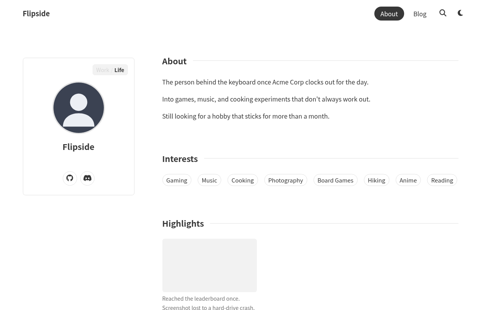
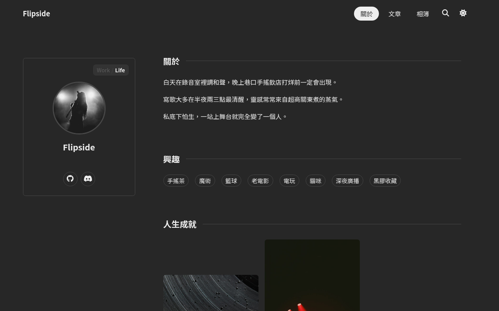
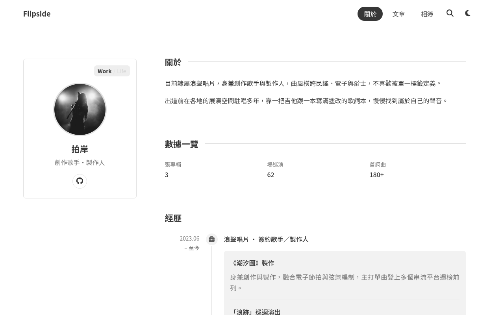
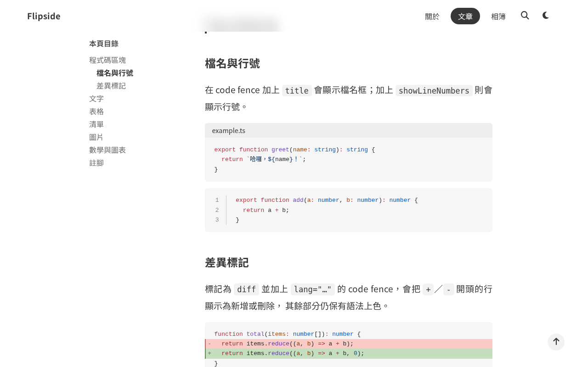

# astro-flipside

[English →](docs/README.en.md)

[](https://github.com/nagameTW/astro-flipside/actions/workflows/ci.yml)
[](LICENSE)


astro-flipside 是一個 Astro 個人網站範本，核心概念很單純：一個 Work/Life
切換鈕，讓「關於」頁面在職涯簡介和個人生活兩種樣貌之間切換。版面和內容區塊
都一樣，換的只有資料。背後搭配一套 Markdown 部落格：程式碼區塊、目錄、標籤、
分頁、搜尋、RSS。



<details>
<summary>更多截圖：暗色主題、Work 面、一篇部落格文章</summary>

<table>
  <tr>
    <td></td>
    <td></td>
    <td></td>
  </tr>
  <tr>
    <td align="center"><sub>Life 面（暗色）</sub></td>
    <td align="center"><sub>Work 面</sub></td>
    <td align="center"><sub>文章頁面（目錄＋程式碼區塊）</sub></td>
  </tr>
</table>

</details>

## 功能

**雙面「關於」頁**

- [x] Work/Life 切換鈕，附 3D 大頭貼翻轉動畫
- [x] 兩個面都用同一組 9 種通用內容區塊組成：text（文字）、chips（標籤）、
      kv（鍵值）、timeline（時間軸）、highlights（亮點）、cards（卡片）、
      stats（數據）、links（連結）、markdown（自由格式）
- [x] Work 面資料在 `src/data/about.ts`，Life 面資料在 `src/data/life.ts`
- [x] `src/data/projects.ts` 和 `ProjectCard.astro` 是為未來 `/projects/`
      頁面準備的骨架，目前還沒接上任何路由

**部落格**

- [x] Expressive Code 程式碼區塊：檔名標籤、行號、diff 標記高亮
- [x] 自動產生的目錄，含捲動追蹤（桌機是側欄，手機是收合選單）、標題錨點、
      中英文皆準確的閱讀時間估算
- [x] Pagefind 全文搜尋，純靜態，不需要伺服器
- [x] 標籤與標籤索引頁、分頁、文章間的上一篇／下一篇導覽
- [x] RSS feed
- [x] 草稿（`draft: true`）只會在 `astro dev` 顯示，正式建置與 RSS 都會
      自動排除
- [x] frontmatter 的 `heroImage` 一魚兩吃：同一張圖也會當作部落格列表中，
      該篇文章卡片的封面圖

**相簿**

- [x] Pinterest 風格的 masonry 版面：用 CSS 多欄排版，照片保留原本的長寬比
- [x] 資料驅動：在 `src/data/gallery.ts` 列出照片，檔案放 `public/gallery/`
- [x] 點圖片會用燈箱放大顯示

**全站共用**

- [x] 暗色模式：跟隨系統設定，或手動切換並記住選擇
- [x] 內建 en／zh-TW 介面字串，改一個設定值就能全部切換
- [x] 選用、預設關閉的功能旗標：KaTeX 數學公式、Mermaid 圖表、giscus 留言，
      關閉時不會佔用任何 bundle 大小
- [x] 支援 GitHub project page 的 base 路徑
- [x] 完全靜態輸出：零密鑰、零伺服器

## 快速開始

1. 在 GitHub 點 **Use this template**（或用
   `gh repo create --template nagameTW/astro-flipside`），然後執行
   `npm install`。
2. 編輯 `src/config.ts`：網站網址、base 路徑、標題、導覽列、社群連結、
   功能旗標。詳見〈[設定參考](#設定參考)〉。
3. 填入你的內容。
   - `src/data/*`：兩個面的「關於」內容（`about.ts`、`life.ts`）、作品集、
     獎盃牆、裝備清單、相簿照片（`gallery.ts` 搭配 `public/gallery/`
     裡的檔案）。
   - `src/content/blog/`：寫你的文章，寫完後刪掉範例文章
     （`welcome.md`、`kitchen-sink.md`、`kitchen-sink-zh.md`）。
4. 到 repo 的 **Settings → Pages**，把 **Source** 設成 **GitHub Actions**。
   執行 `npm run dev` 在本機預覽；推上 `main` 就會部署（詳見
   〈[部署](#部署)〉）。

## 指令

所有指令都在專案根目錄的終端機執行：

| 指令              | 說明                                             |
| :---------------- | :----------------------------------------------- |
| `npm run dev`     | 在 `localhost:4321` 啟動本機開發伺服器           |
| `npm run build`   | 建置正式版網站到 `dist/`，再用 Pagefind 建立索引 |
| `npm run preview` | 部署前，在本機預覽正式版建置結果                 |
| `npm run check`   | 對專案做型別檢查（Astro 和 TypeScript）          |
| `npm test`        | 執行 plugin 的單元測試（`plugins/*.test.mjs`）   |
| `npm run fmt`     | 用 Prettier 格式化程式碼                         |

## 專案結構

```
src/
├── components/    # Astro 元件：Navbar、Footer、FaceToggle、blocks/ 等
├── content/blog/  # ← 部落格文章（.md / .mdx）
├── data/          # ← 關於／Life 頁內容、相簿、作品集、獎盃牆
├── layouts/       # Layout.astro、BlogPost.astro
├── locales/       # en.ts／zh-TW.ts 介面字串字典
├── pages/         # 路由：首頁、部落格、標籤、相簿、RSS、sitemap
├── styles/        # global.css
├── utils/         # 閱讀時間、時間軸、URL 工具函式
└── config.ts      # ← 網站設定的唯一來源
```

三個箭頭標示的地方，是你架設新站時真正要編輯的內容；其餘都是範本內部的
實作細節。

## 部署

`.github/workflows/deploy.yml` 會執行 `npm run check && npm run build`，
再透過 GitHub Pages 原生的 Actions 部署（`actions/deploy-pages`）發布，
每次推上 `main` 都會觸發。只需要設定一次：
**Settings → Pages → Build and deployment → Source: GitHub Actions**。

`src/config.ts` 裡的 `site` 和 `base`（唯一真實來源，`astro.config.mjs`
也是從這裡讀取）要跟部署方式對應：

| 部署方式         | Repo 名稱          | `site`                       | `base`           | 結果網址                                |
| ---------------- | ------------------ | ----------------------------- | ----------------- | ---------------------------------------- |
| Project page     | 任意               | `"https://<user>.github.io"` | `"/<repo-name>"` | `https://<user>.github.io/<repo-name>/` |
| 使用者／組織首頁 | `<user>.github.io` | `"https://<user>.github.io"` | `""`             | `https://<user>.github.io/`             |

這個 repo 本身就是以 project page 的方式部署（`base: "/astro-flipside"`），
線上示範在 <https://nagametw.github.io/astro-flipside/>。

## 選用模組

**獎盃牆**（Life 面，Highlights 卡片）：編輯 `src/data/trophies.ts`；截圖
放在 `public/trophies/`。`src` 留空會顯示佔位方塊。

**裝備清單**（Life 面，Gear 區塊）：編輯 `src/data/life.ts` 裡的 `GEAR`
陣列。

## 設定參考

`src/config.ts` 的每一個欄位：

| 欄位               | 說明                                                                                                        |
| ------------------ | ------------------------------------------------------------------------------------------------------------- |
| `site`             | 部署的網域，結尾不加斜線。                                                                                  |
| `base`             | GitHub project page 的子路徑（例如 `"/astro-flipside"`）；使用者／根網域頁面留 `""`。                       |
| `title`            | 網站名稱：導覽列品牌字、`<title>`、RSS 頻道標題；同時是 Life 面身分卡顯示的名稱（該面沒有獨立的名字欄位）。 |
| `description`      | 網站的 meta description；RSS 頻道描述；文章沒有自己的描述時的預設值。                                       |
| `author`           | 你的名字。會輸出成每個頁面的 `<meta name="author">` 標籤（目前唯一會讀取這個欄位的地方）。                  |
| `locale`           | `"en"` 或 `"zh-TW"`；決定介面字串字典（`src/locales/`）跟 `<html lang>`。                                   |
| `nav`              | 導覽列連結；每個 `label` 是介面字典裡的一個 key。                                                           |
| `socials`          | Life 面大頭貼卡片的社群按鈕；`url` 會開啟連結，`copy` 會複製文字（像 Discord 那樣）。                       |
| `github`           | Work 面大頭貼卡片上的 GitHub 連結。                                                                         |
| `features.math`    | 文章裡的 KaTeX 數學公式（`$…$` / `$$…$$`）。預設關閉；關閉時不佔 bundle 大小。                              |
| `features.mermaid` | 文章裡的 ` ```mermaid ` 圖表。預設關閉；關閉時不佔 bundle 大小。                                            |
| `features.giscus`  | `false`，或是 [giscus.app](https://giscus.app) 給的四個資料屬性，設定後開啟留言功能。                       |

## 語言

整個介面（不是逐篇文章）只認一種語言，預設是 `"zh-TW"`。想改成英文的話，
把 `src/config.ts` 的 `locale` 設成 `"en"` 即可，內建字串會整批切換。兩份
字典都在 `src/locales/`；要加新語言，複製 `en.ts` 的 key 照著填就行。

English: [docs/README.en.md](docs/README.en.md)

## 參與貢獻

歡迎 issue 和 PR。回報問題或提功能想法請走 [issue 表單](../../issues/new/choose)；
小修正可以直接開 PR，較大的改動建議先開 issue 討論方向，確認再動手。

開發環境、專案結構與慣例見 [CONTRIBUTING.md](CONTRIBUTING.md)；PR
表單會引導你填寫其餘內容（變更類型、測試方式、視覺變更截圖）。CI 跑的
就是你在本地能跑的那三個檢查：`npm run check && npm run build && npm test`。

## 致謝

以 [Tocas UI](https://tocas-ui.com/) 打底。部落格的骨架依循 Astro 官方
blog starter 的做法。

## 授權

MIT。詳見 [LICENSE](LICENSE)。
