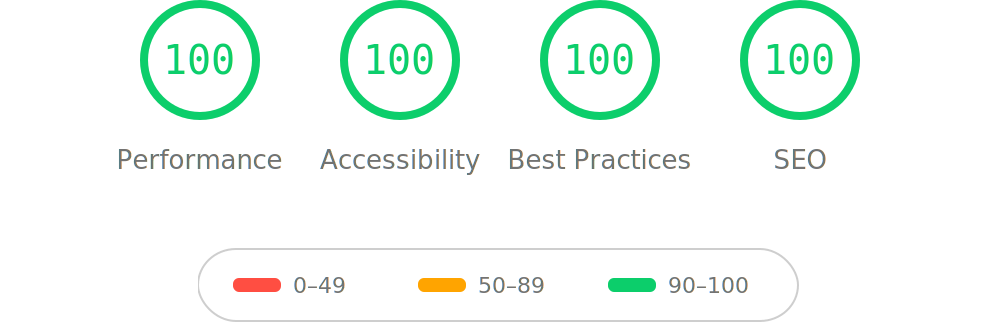

<div align="center">

[](https://github.com/nagameTW/astro-flipside/actions/workflows/ci.yml)
[](LICENSE)

[](https://tocas-ui.com/)

[](CONTRIBUTING.md)


<h3 align="center">Flipside</h3>

<p align="center">
  翻個面，認識另一個你。
  <br />
  <br />
  <a href="https://astro-flipside.vercel.app/">線上示範</a>
  ·
  <a href="../../issues/new/choose">回報問題</a>
  ·
  <a href="../../issues/new/choose">功能許願</a>
  <br />
  README in <strong>繁體中文</strong> / <a href="docs/README.en.md">English</a>
</p>

</div>

<details>
  <summary>目錄</summary>
  <ol>
    <li><a href="#關於-flipside">關於 Flipside</a></li>
    <li><a href="#lighthouse-分數">Lighthouse 分數</a></li>
    <li><a href="#快速開始">快速開始</a></li>
    <li><a href="#指令">指令</a></li>
    <li><a href="#專案結構">專案結構</a></li>
    <li><a href="#部署">部署</a></li>
    <li><a href="#語言">語言</a></li>
    <li><a href="#參與貢獻">參與貢獻</a></li>
    <li><a href="#授權">授權</a></li>
    <li><a href="#致謝">致謝</a></li>
  </ol>
</details>

## 關於 Flipside

白天，你穿梭在信件與會議中，用名片上的職稱介紹自己，夜晚，你練琴、打球，或者換上一個只有同好才知道的 ID 上線。

兩個都是你，卻很少同時出現在同一個地方。

多數個人網站只有一種版型、一種敘事方式，於是我們總得取捨。要展現專業，還是分享熱愛？最終，只能讓其中一面代表自己。

但，何必妥協。

就像一枚硬幣，正面是專業，反面是熱愛。兩面都是真實的自己，只需要翻個面，讓訪客從不同角度認識你。

這就是 Flipside，一個簡潔、中文友善的 Astro 主題。它基於我的個人網站專案，移除了所有私人內容，保留開發過程中累積的設計思考，整理成一個可以直接使用的網站起點，希望讓更多人能打造一個既能展現專業，也能保留個人特色的專屬空間。

- [Astro](https://astro.build/) — 靜態輸出的網站框架
- [Tocas UI](https://tocas-ui.com/) — 為中文設計的 UI 框架
- [Expressive Code](https://expressive-code.com/) — 程式碼區塊
- [Pagefind](https://pagefind.app/) — 純靜態全文搜尋

## Lighthouse 分數

<p align="center">
  <a href="https://pagespeed.web.dev/analysis?url=https%3A%2F%2Fastro-flipside.vercel.app%2F&form_factor=mobile">
    
  </a>
</p>

## 快速開始

**1. 建立你的 repo**

點上方 **Use this template**，或用 GitHub CLI：

```bash
gh repo create my-site --template nagameTW/astro-flipside --public --clone
```

**2. 本機執行**

```bash
cd my-site
npm install
npm run dev     # 開 http://localhost:4321，改檔即時更新
```

**3. 填你的網址**

編輯 `src/config.ts` 最上面兩欄，照第 1 步的網址填：

```ts
site: "https://<帳號>.github.io",
base: "/my-site", // repo 叫 <帳號>.github.io 的話，這裡留 ""
```

**4. 開啟 GitHub Pages**

到 repo 的 **Settings → Pages**，把 **Source** 選成 **GitHub Actions**。設一次就好。

**5. 部署**

```bash
git add -A
git commit -m "first deploy"
git push        # Actions 自動建置，約一分鐘後網站上線
```

之後 push 到 `main`，自動重新部署。

樣式或圖片全不見了？回第 3 步，檢查 `base`。內容怎麼加，看[新增內容](#新增內容)的三個範例。

Netlify、Vercel、Cloudflare Pages 也行。做法見 [Astro 部署指南](https://docs.astro.build/en/guides/deploy/)。

## 新增內容

- 文章 → `src/content/blog/`
- 專案 → `src/data/projects.ts`
- 相簿 → `src/data/gallery.ts`

存檔後，`npm run dev` 立刻更新。

**寫一篇文章**

在 `src/content/blog/` 新增 `.md` 或 `.mdx` 檔，圖片放在文章旁邊、用相對路徑引用：

```md
---
title: "文章標題"
description: "列表與搜尋結果顯示的摘要" # 可省略
pubDate: "2026-07-13"
updatedDate: "2026-07-20" # 可省略
heroImage: "./cover.jpg" # 可省略；文章頁大圖，兼列表縮圖
tags: ["life", "music"] # 可省略
draft: true # 草稿只在 dev 顯示，建置自動排除
---

內文就是一般 Markdown。相對路徑的圖片 `` 會自動轉
webp 並產生響應式尺寸；程式碼區塊、表格、目錄、標籤都是內建。
```

想看全部排版，對照範例文章「功能總覽」（`src/content/blog/kitchen-sink-zh.md`）最快。

**加一個專案**

在 `src/data/projects.ts` 的 `PROJECTS` 陣列加一筆：

```ts
{
  name: "專案名稱",
  description: "一句話說明。",
  tech: ["Astro", "TypeScript"],       // 顯示成技術標籤
  url: "https://github.com/you/repo",  // 整個區塊都連到這裡
  img: cover,                          // 可省略；檔案頂部 import 的圖或 https URL
},
```

**加一張照片**

圖檔放進 `src/assets/gallery/`，在 `src/data/gallery.ts` import 後加一筆：

```ts
{
  src: photo,                        // import 的圖或 https URL
  alt: "給讀屏器與搜尋引擎的描述",   // 必填
  caption: "圖下與燈箱顯示的說明",   // 可省略
},
```

陣列順序就是顯示順序。

## 指令

在專案根目錄執行：

| 指令              | 說明                                             |
| :---------------- | :----------------------------------------------- |
| `npm run dev`     | 在 `localhost:4321` 啟動本機開發伺服器           |
| `npm run build`   | 建置正式版網站到 `dist/`，再用 Pagefind 建立索引 |
| `npm run preview` | 在本機預覽正式版建置結果                         |
| `npm run check`   | 對專案做型別檢查                                 |
| `npm test`        | 執行 `plugins/*.test.mjs` 的單元測試             |
| `npm run fmt`     | 用 Prettier 格式化程式碼                         |

## 專案結構

```
src/
├── components/    # Astro 元件：Navbar、Footer、FaceToggle、blocks/ 等
├── content/blog/  # ← 部落格文章（.md / .mdx）
├── data/          # ← 關於／Life 頁內容、相簿、作品集、獎盃牆
├── layouts/       # Layout.astro、BlogPost.astro
├── locales/       # en.ts／zh-TW.ts 介面字串字典
├── pages/         # 路由：首頁、關於、部落格、標籤、相簿、專案、RSS
├── styles/        # global.css
├── utils/         # 文章、時間軸、URL、對話框工具函式
└── config.ts      # ← 網站設定的唯一來源
```

箭頭標示的地方是架設新站時真正要編輯的內容。

## 部署

`.github/workflows/deploy.yml`：每次 push 到 `main`，跑 `npm run check && npm run build`，再用 GitHub Pages 原生的 Actions 發布。設定一次就好：**Settings → Pages → Build and deployment → Source: GitHub Actions**。

`site` 和 `base` 要對上部署方式：

| 部署方式         | Repo 名稱          | `site`                       | `base`           | 結果網址                                |
| ---------------- | ------------------ | ---------------------------- | ---------------- | --------------------------------------- |
| Project page     | 任意               | `"https://<user>.github.io"` | `"/<repo-name>"` | `https://<user>.github.io/<repo-name>/` |
| 使用者／組織首頁 | `<user>.github.io` | `"https://<user>.github.io"` | `""`             | `https://<user>.github.io/`             |

### 部署到 Vercel

匯入 repo 就好，設定不用動。

到 [vercel.com](https://vercel.com) 用 GitHub 登入，**Add New → Project**，匯入 repo，按 **Deploy**。

之後每次 push 到 `main` 自動重新部署，開 PR 會附一個預覽網址。純靜態輸出，免費的 Hobby 方案就夠，不需要任何 adapter。

## 語言

預設 `"zh-TW"`。想改英文的話，把 `src/config.ts` 的 `locale` 設成 `"en"` 即可。

字典在 `src/locales/`。要加新語言，複製 `en.ts` 的 key，照著填就行。

## 參與貢獻

歡迎 issue 和 PR。回報問題、許願功能請走 [issue 表單](../../issues/new/choose)。小修正直接開 PR；大改動則先開 issue 聊聊方向。

開發環境與慣例，見 [CONTRIBUTING.md](CONTRIBUTING.md)。

## 授權

MIT。詳見 [LICENSE](LICENSE)。

## 致謝

底層是 [Tocas UI](https://tocas-ui.com/)。部落格骨架依循 Astro 官方 blog starter。
