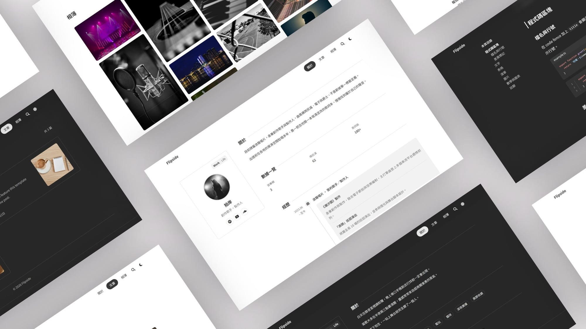
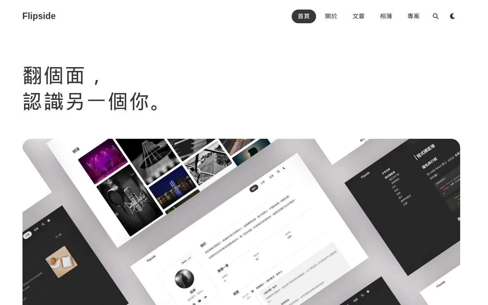
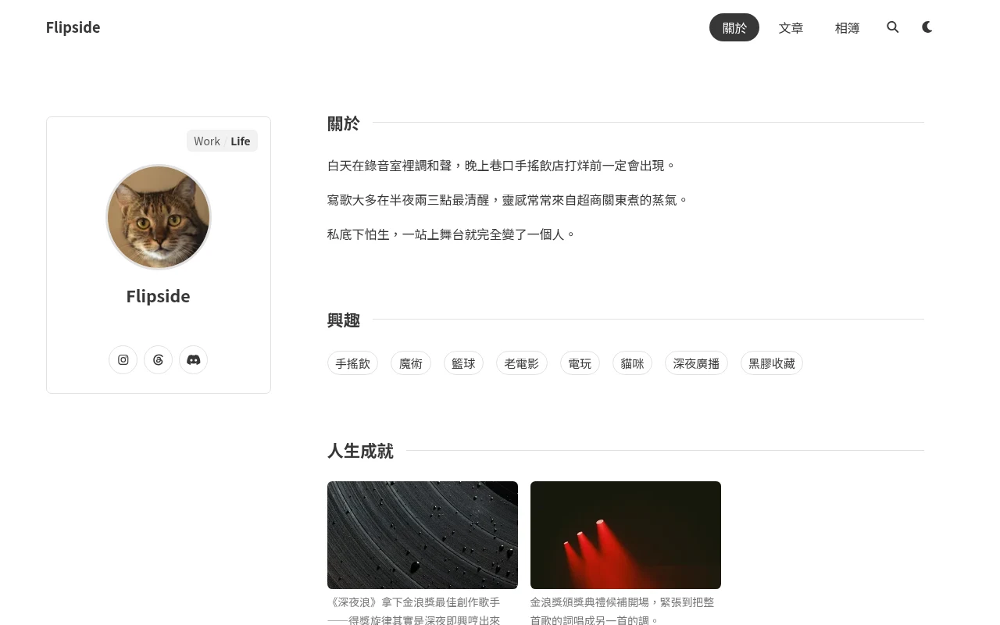
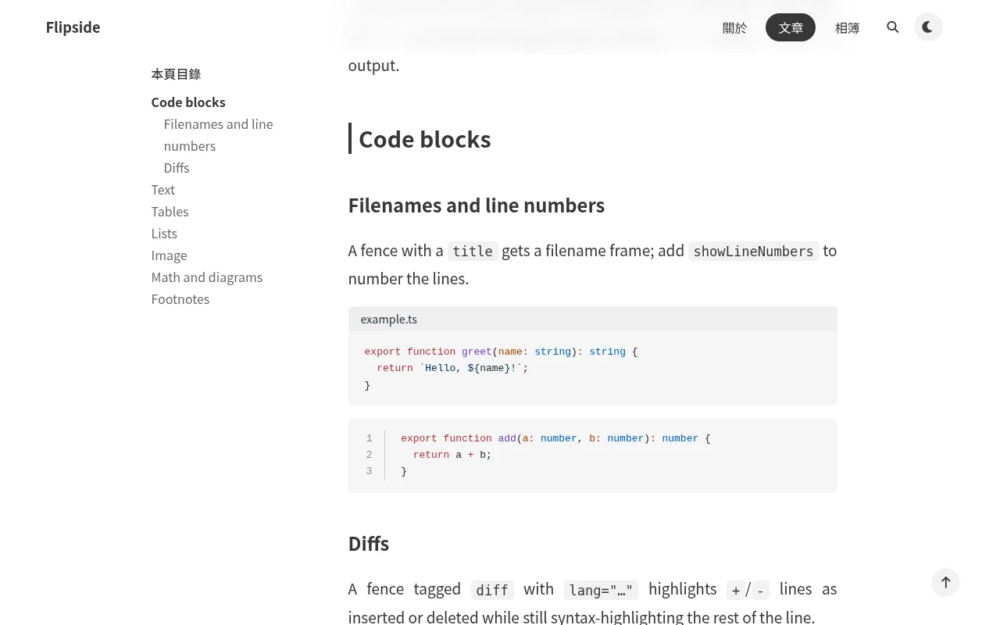
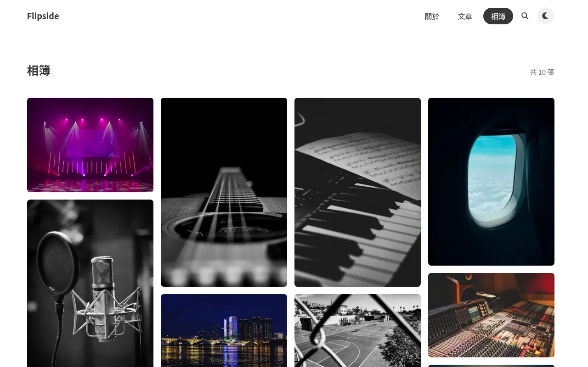
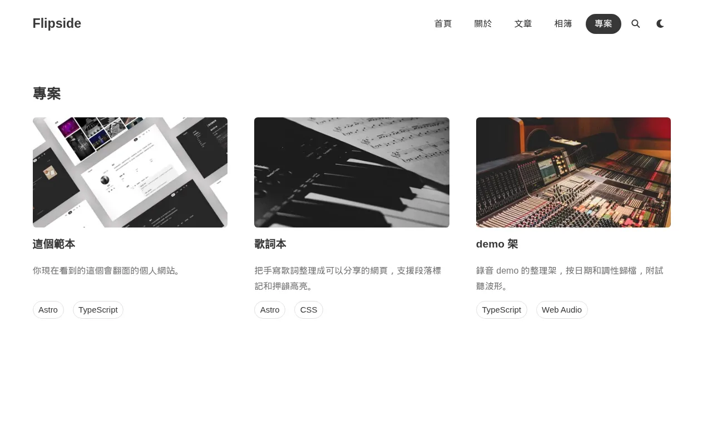
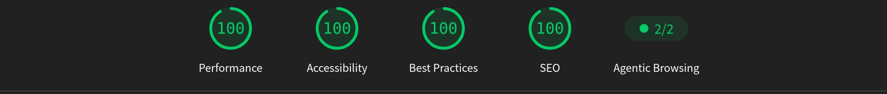
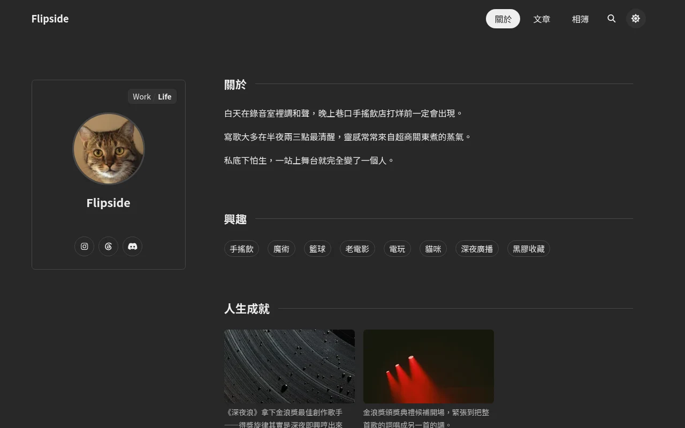

<div align="center">

[](https://github.com/nagameTW/astro-flipside/actions/workflows/ci.yml)
[](../LICENSE)

[](https://tocas-ui.com/)

[](../CONTRIBUTING.md)


<h3 align="center">Flipside</h3>

<p align="center">
  Flip it over, meet the other you.
  <br />
  <br />
  <a href="https://nagametw.github.io/astro-flipside/">Live demo</a>
  ·
  <a href="../../../issues/new/choose">Report a bug</a>
  ·
  <a href="../../../issues/new/choose">Request a feature</a>
  <br />
  README in <a href="../README.md">繁體中文</a> / <strong>English</strong>
</p>

</div>

<details>
  <summary>Table of contents</summary>
  <ol>
    <li><a href="#-about-flipside">About Flipside</a></li>
    <li><a href="#-getting-started">Getting started</a></li>
    <li><a href="#-features">Features</a></li>
    <li><a href="#-commands">Commands</a></li>
    <li><a href="#-project-structure">Project structure</a></li>
    <li><a href="#-deploy">Deploy</a></li>
    <li><a href="#-locale">Locale</a></li>
    <li><a href="#-roadmap">Roadmap</a></li>
    <li><a href="#-contributing">Contributing</a></li>
    <li><a href="#-license">License</a></li>
    <li><a href="#-contact">Contact</a></li>
    <li><a href="#-acknowledgments">Acknowledgments</a></li>
  </ol>
</details>

## 🪙 About Flipside

By day you move between email and meetings, introducing yourself by
the title on your business card. By night you practice guitar, play
ball, or slip into an ID only fellow fans would know.

Both are you, yet they rarely show up in the same place.

Most personal sites give you one layout and one way to tell your
story, so you keep having to choose: show the profession, or share
the passion? In the end, one side gets to stand for all of you.

But why compromise.

Like a coin: profession on the front, passion on the back. Both sides
are the real you. One flip, and visitors meet you from another angle.

This is Flipside, a clean, Chinese-friendly Astro theme. It grew out
of my personal site: everything private removed, the design thinking
kept, shaped into a starting point you can use right away, so that
more people can build a space of their own that shows their
profession and keeps what makes them who they are.



### 🛠️ Built with

- [Astro](https://astro.build/) — the static-output site framework
- [Tocas UI](https://tocas-ui.com/) — a UI framework designed for Chinese
- [Expressive Code](https://expressive-code.com/) — code frames
- [Pagefind](https://pagefind.app/) — static full-text search

## 🚀 Getting started

**1. Create your repo**

Click **Use this template** at the top, or use the GitHub CLI:

```bash
gh repo create my-site --template nagameTW/astro-flipside --public --clone
```

The repo name decides your URL: name it `<user>.github.io` and the site
lives at `https://<user>.github.io/`; any other name (say `my-site`) puts
it at `https://<user>.github.io/my-site/`.

**2. Run it locally**

```bash
cd my-site
npm install
npm run dev     # http://localhost:4321, live-reloads as you edit
```

**3. Point it at your URL**

Edit the top two fields of `src/config.ts` to match step 1:

```ts
site: "https://<user>.github.io",
base: "/my-site", // leave "" when the repo is named <user>.github.io
```

**4. Turn on GitHub Pages**

In the repo's **Settings → Pages**, set **Source** to **GitHub Actions**.
One-time setup.

**5. Deploy**

```bash
git add -A
git commit -m "first deploy"
git push        # Actions builds and deploys; live in about a minute
```

Every later push to `main` redeploys automatically. If the site comes up
unstyled or without images, go back to step 3 and check `base`. For adding
content, copy the three examples under
[Adding content](#-adding-content); every other field in
`src/config.ts` carries its own comment. Delete the demo content once
you've read it.

Netlify, Vercel, and Cloudflare Pages work too: the template is fully
static, so importing the repo is enough (set `base` to `""`). See the
[Astro deployment guide](https://docs.astro.build/en/guides/deploy/).

## ✍️ Adding content

Each kind of content has one place: posts in `src/content/blog/`,
projects in `src/data/projects.ts`, photos in `src/data/gallery.ts`.
Save, and `npm run dev` picks the change up immediately.

**Write a post**

Add a `.md` (or `.mdx`) file under `src/content/blog/`, keep its images
next to the file, and reference them with relative paths:

```md
---
title: "Post title"
description: "Blurb for the list and search results" # optional
pubDate: 2026-07-13
updatedDate: 2026-07-20 # optional
heroImage: "./cover.jpg" # optional; post hero + list thumbnail
tags: ["life", "music"] # optional
draft: true # drafts render in dev only
---

The body is plain Markdown. Relative images like ``
ship as responsive webp automatically; code frames, tables, the table
of contents, and tags are all built in.
```

The "Kitchen sink" demo post (`src/content/blog/kitchen-sink.md`) shows
every supported construct; copying it is the fastest start.

**Add a project**

Append an entry to `PROJECTS` in `src/data/projects.ts`:

```ts
{
  name: "Project name",
  description: "One line on what it is.",
  tech: ["Astro", "TypeScript"],       // rendered as tech tags
  url: "https://github.com/you/repo",  // the whole block links here
  img: cover,                          // optional; a top-of-file import or an https URL
},
```

**Add a photo**

Drop the file into `src/assets/gallery/`, import it in
`src/data/gallery.ts`, and add an entry:

```ts
{
  src: photo,                     // an imported file or an https URL
  alt: "Description for screen readers and search",  // required
  caption: "Line shown under the photo and in the lightbox",  // optional
},
```

Array order is display order.

## ✨ Features

**Home**

- [x] Big-tagline landing with the site collage and previews of the
      about, blog, gallery, and projects sections, closed by a dark band
- [x] Alternating section tints and scroll-entrance animations



**Dual-face about**

- [x] Work/Life toggle with a 3D avatar flip
- [x] Both faces render from the same 9 generic content blocks: text, chips,
      key-value, timeline, highlights, cards, stats, links, freeform markdown
- [x] Work face data in `src/data/about.ts`, Life face data in
      `src/data/life.ts`



**Blog**

- [x] Expressive Code fenced blocks: filenames, line numbers, diff
      highlighting
- [x] Table of contents with scroll-spy, heading anchors, and CJK-aware
      reading time
- [x] Pagefind full-text search, static, no server involved
- [x] Tags with a tag index, pagination, and prev/next navigation
- [x] RSS feed
- [x] Drafts (`draft: true`) show only in `astro dev`; production builds and
      the RSS feed exclude them automatically
- [x] `heroImage` in frontmatter doubles as the post's cover image on the
      blog index



**Gallery**

- [x] Pinterest-style masonry layout: CSS multi-column, so photos keep their
      own aspect ratio instead of being cropped into a fixed grid
- [x] Data-driven: drop the files in `src/assets/gallery/`, import and list them in `src/data/gallery.ts` (auto webp + responsive sizes)
- [x] Click a photo to open it full-size in a lightbox



**Projects**

- [x] Portfolio page — name, description, tech tags, link, and cover image,
      all from `src/data/projects.ts`
- [x] 3-up grid of fully clickable blocks, paginated every 9 entries; the
      page size lives in `src/config.ts` under `pageSize`



**Everywhere**

- [x] Page navigations swap in place — no full-page reload flash
- [x] Momentum smooth scrolling; reduced-motion visitors get native behavior
- [x] Dark mode: follows OS preference, or an explicit toggle that persists
- [x] Built-in en / zh-TW UI strings, switched with one config flag
- [x] Optional, flag-gated KaTeX math, Mermaid diagrams, and giscus
      comments, each at zero bundle cost when off
- [x] Base-path support for GitHub project pages
- [x] Fully static output: zero secrets, zero server
- [x] Mobile Lighthouse on the home page: 100 in all four categories





## 🧰 Commands

All commands run from the project root, in a terminal:

| Command           | Action                                                               |
| :---------------- | :------------------------------------------------------------------- |
| `npm run dev`     | Starts the local dev server at `localhost:4321`                      |
| `npm run build`   | Builds the production site to `dist/`, then indexes it with Pagefind |
| `npm run preview` | Previews the production build locally                                |
| `npm run check`   | Type-checks the project                                              |
| `npm test`        | Runs the plugin unit tests (`plugins/*.test.mjs`)                    |
| `npm run fmt`     | Formats the codebase with Prettier                                   |

## 🗂️ Project structure

```
src/
├── components/    # Astro components: Navbar, Footer, FaceToggle, blocks/, ...
├── content/blog/  # ← blog posts (.md / .mdx)
├── data/          # ← About/Life copy, gallery, projects, trophies
├── layouts/       # Layout.astro, BlogPost.astro
├── locales/       # en.ts / zh-TW.ts UI string dictionaries
├── pages/         # Routes: home, about, blog, tags, gallery, projects, RSS, sitemap
├── styles/        # global.css
├── utils/         # Reading time, timeline, URL helpers
└── config.ts      # ← single source of site configuration
```

The three arrows are what you edit for a new site. Everything else is
template internals.

## 🚢 Deploy

`.github/workflows/deploy.yml` builds with `npm run check && npm run build`
and publishes through GitHub Pages' native Actions deployment
(`actions/deploy-pages`) on every push to `main`. Enable it once:
**Settings → Pages → Build and deployment → Source: GitHub Actions**.

`site` and `base` in `src/config.ts` must match how the repo is
published:

| Deployment             | Repo name          | `site`                       | `base`           | Result                                  |
| ---------------------- | ------------------ | ---------------------------- | ---------------- | --------------------------------------- |
| Project page           | anything           | `"https://<user>.github.io"` | `"/<repo-name>"` | `https://<user>.github.io/<repo-name>/` |
| User/organization page | `<user>.github.io` | `"https://<user>.github.io"` | `""`             | `https://<user>.github.io/`             |

This repo deploys itself as a project page; the live demo is at
<https://nagametw.github.io/astro-flipside/>.

## 🌐 Locale

The UI reads one locale, and it defaults to `"zh-TW"`. Set
`locale: "en"` in `src/config.ts` to switch to the English strings
instead. Both dictionaries live in `src/locales/`; add another language
by copying `en.ts`'s keys.

## 🗺️ Roadmap

- [x] Home page: a landing with a big tagline, the site collage, and
      previews of every section
- [x] `/projects/` portfolio page

Planned work and known issues live in the
[open issues](../../../issues).

## 🤝 Contributing

Issues and pull requests are welcome. Bug reports and feature ideas go
through the [issue forms](../../../issues/new/choose); small fixes can go
straight to a PR, and it's worth opening an issue first for anything
bigger so we can agree on the shape before you build it.

[CONTRIBUTING.md](../CONTRIBUTING.md) covers the dev setup, repo map, and
conventions; the PR form walks you through the rest. CI runs the same
three checks you can run locally:
`npm run check && npm run build && npm test`.

## 📄 License

MIT. See [LICENSE](../LICENSE).

## 📫 Contact

Author: [nagameTW](https://github.com/nagameTW)

Project link: <https://github.com/nagameTW/astro-flipside>

## 🙏 Acknowledgments

Built on [Tocas UI](https://tocas-ui.com/). Blog scaffolding follows the
official Astro blog starter.
